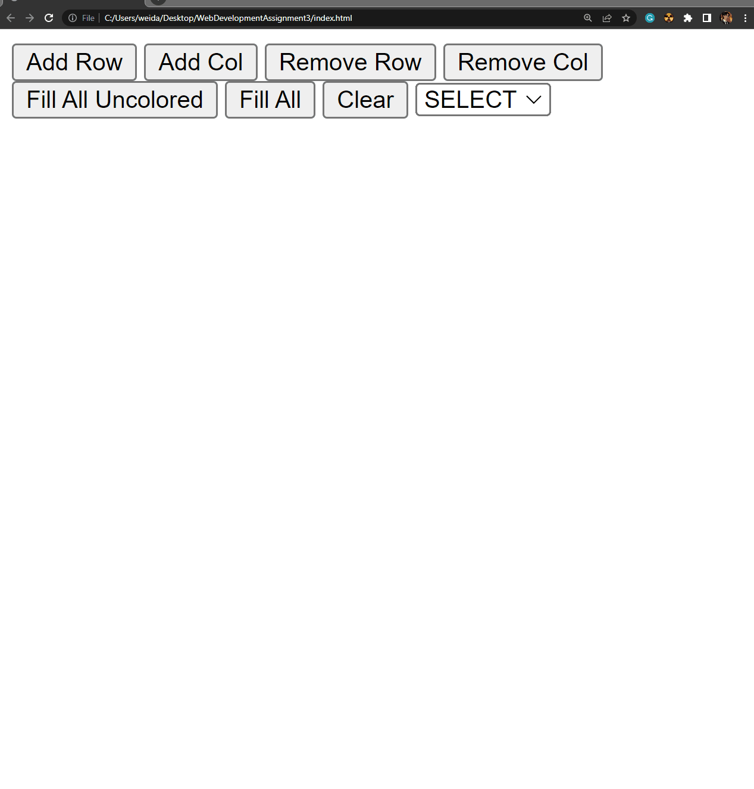

# Assignment 3 - Grid Maker 

[Website Link](https://tommyliang1.github.io/WebDevelopmentAssignment3/)

## Table of Contents

1. [Group Members](#Group-Members)
2. [Overview](#Overview)
3. [Product Spec](#Product-Spec)
4. [GIF](#GIF)
5. [Grading](#Grading)

## Group Members

1. Wei Da Chen - [chenweida6220](https://github.com/chenweida6220) 
2. Tommy Liang - [TommyLiang1](https://github.com/TommyLiang1) 
3. Kevin Hardyal - [kevinville](https://github.com/kevinville) 
4. Stephanie Kim - [steph-kimm](https://github.com/steph-kimm) 

## Overview

**Goal**

To further demonstrate an understanding of Git/GitHub, HTML, CSS, JavaScript, DOM manipulation, and handling user events.

## Product Spec

**Required**

Assignment functionalities are listed as user stories below. For each user story, make a feature branch on GitHub.

Based on the in-class demonstration, complete the following user stories and functionalities:
As a user, I can:
- [x] select an action from a menu
- [x] add rows to the grid
- [x] add columns to the grid
- [x] remove rows from the grid
- [x] remove columns from the grid
- [x] select a color from a dropdown menu of colors
- [x] click on a single cell, changing its color to the currently selected color
- [x] fill an uncolored cells with the currently selected color
- [x] fill all cells with the currently selected color
- [x] clear all cells' color and restore all cells to their original/initial color

## GIF

## Grading 

- 7% - Assignment functionality
- 2% - Code documentation (i.e., proper commenting). Code organization (i.e., the code is clean, well-formatted, and easy-to-read). Git version control such as following Git feature branch workflow, creating pull requests when merging feature branches, making small and frequent commits with appropriate commit messages, etc.
- 1% - Deployment of the website to GitHub Pages